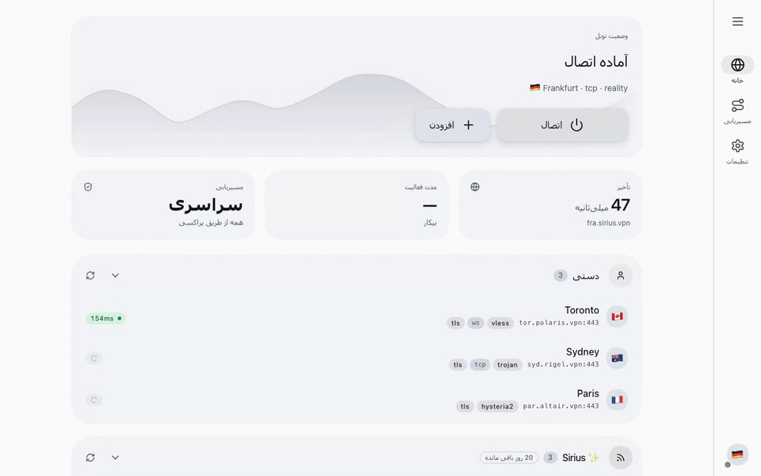

[English](./README.md) · [Русский](./README.ru.md) · [Español](./README.es.md) · [中文](./README.zh-CN.md) · [فارسی](./README.fa.md) · [العربية](./README.ar.md)

<p align="center">
  <picture>
    <source media="(prefers-color-scheme: dark)" srcset="./site/media/logo-dark.png">
    
  </picture>
</p>

<p align="center"><strong>افزونه VLESS برای مرورگر Chrome</strong></p>
<p align="center"><em>مسیریابی ترافیک مرورگر از طریق پراکسی‌های خودتان — بدون VPN سیستمی.</em></p>

<p align="center">
  <a href="https://chromewebstore.google.com/detail/noctis/nmhobajopepdpihahepaddpdifdcenpn"></a>
  <a href="./site/LICENSE.md"></a>
  <a href="https://github.com/c0nn3ct-info/noctis"></a>
  <a href="https://noctis.c0nn3ct.info"></a>
</p>

<p align="center">
  <picture>
    <source media="(prefers-color-scheme: dark)" srcset="./site/media/demo-fa-dark.gif">
    
  </picture>
</p>

> [!IMPORTANT]
> Noctis یک پراکسی مرورگر است — نه یک VPN سیستمی. فقط ترافیک Chrome مسیریابی می‌شود؛ بقیه سیستم‌عامل شما روی اتصال واقعی‌تان باقی می‌ماند. افزونه تحت یک EULA اختصاصی رایگان است؛ مؤلفه محلی متن‌باز است (MIT).

Noctis یک افزونه رایگان مرورگر است که ترافیک Chrome را از طریق سرورهای پراکسی VLESS، VMess، Trojan، Shadowsocks، Hysteria2، Reality و دیگر سرورها — با یک مؤلفه محلی که یک موتور پراکسی ماژولار را اجرا می‌کند: sing-box، xray-core یا mihomo — مسیریابی می‌کند. بدون VPN سیستمی، بدون پنجره کلاینت جداگانه — پراکسی داخل خود مرورگر باقی می‌ماند.

## ✨ امکانات

- **موتور پراکسی ماژولار** — Noctis همراه sing-box عرضه می‌شود و می‌تواند xray-core یا mihomo را نیز اجرا کند و موتور موردنیاز هر سرور را به‌طور خودکار انتخاب می‌کند — بنابراین xhttp، جریان‌های REALITY-vision، Snell و موارد دیگر به‌سادگی کار می‌کنند.
- **سرورها از پیوند اتصال، کد QR یا اشتراک** — یک پیوند `vless://`، `vmess://`، `trojan://`، `ss://`، `hysteria2://`، `tuic://` یا `wireguard://` وارد کنید یا کد QR را اسکن کنید. اشتراک‌ها طبق برنامه به‌طور خودکار به‌روزرسانی می‌شوند.
- **مسیریابی بر اساس قانون** — تطبیق بر اساس دامنه، GeoSite یا GeoIP. هر قانون به پراکسی، مستقیم یا مسدود مسیریابی می‌کند.
- **سه حالت مسیریابی** — سراسری همه چیز را از طریق پراکسی می‌فرستد. قوانین فقط موارد منطبق را مسیریابی می‌کند. مستقیم به‌کلی پراکسی را دور می‌زند.
- **بررسی سلامت + جابه‌جایی خودکار** — سنجش تأخیر در پس‌زمینه؛ پینگ دستی هر سرور با یک ضربه. سرورهای ناموفق از مسیر فعال خارج می‌شوند.
- **فهرست کوتاه سرورهای سنجاق‌شده** — سه سرور موردعلاقه را بالای پنجره بازشو نگه دارید. سرور فعال را بدون باز کردن پنل کامل تغییر دهید.
- **جریان زنده گزارش‌ها** — stdout و stderr موتور پراکسی داخل افزونه استریم می‌شوند. مشکلات اتصال را بدون خروج از مرورگر عیب‌یابی کنید.
- **محافظ نشت WebRTC** — یک تغییردهنده اختیاری UDP خارج از پراکسی را مسدود می‌کند تا WebRTC نتواند IP واقعی شما را فاش کند.
- **قوانین داخلی مسدودسازی تبلیغ و ردیاب** — خانواده‌های `geosite:ads` به‌طور پیش‌فرض به مسدود مسیریابی می‌شوند. اگر ترجیح می‌دهید آن را جای دیگری مدیریت کنید، خاموشش کنید.

## 🔌 پروتکل‌های پراکسی پشتیبانی‌شده

`VLESS` · `VLESS Reality` · `VMess` · `Trojan` · `Shadowsocks` · `Hysteria/2` · `TUIC` · `WireGuard` · `AnyTLS` · `ShadowTLS`

Noctis از VLESS (از جمله VLESS Reality)، VMess، Trojan، Shadowsocks، Hysteria2، TUIC، WireGuard، AnyTLS و ShadowTLS پشتیبانی می‌کند. پیکربندی‌های V2Ray، Xray و پنل‌های 3X-UI بدون تبدیل دستی کار می‌کنند: پیوند اتصال یا اشتراک را وارد کنید تا افزونه پیکربندی موتور مناسب را آماده کند. Xray از xhttp/splithttp و گونه‌های جریان XTLS و Mihomo از Snell، SSR و پروتکل‌های دیگر پشتیبانی می‌کند.

## 🧩 چگونه کار می‌کند

مرورگرها نمی‌توانند به‌تنهایی یک موتور پراکسی را اجرا کنند. سه قطعه کار را در مرز sandbox تقسیم می‌کنند — و پیکانی که از آن عبور می‌کند تنها جایی است که پیام‌ها جریان می‌یابند.

```
  Browser                                    Your machine
  ┌──────────────────┐  native messaging   ┌──────────────────┐
  │ Noctis extension │ ◀─────────────────▶ │  noctis-host     │
  │ popup · panel    │   events · logs     │ (native helper)  │
  │ options          │                     └────────┬─────────┘
  └────────┬─────────┘                              │ spawn · config
           │                                        ▼
           │                                ┌──────────────────┐
           │  Chrome proxy → SOCKS/HTTP     │  proxy engine    │
           └───────────────────────────────▶│                  │
                                            └────────┬─────────┘
                                                     │ encrypted
                                                     ▼
                                            ┌──────────────────┐
                                            │  Proxy servers   │
                                            └──────────────────┘
```

Noctis به‌طور پیش‌فرض همراه sing-box عرضه می‌شود و می‌تواند xray-core و mihomo را نیز اجرا کند. یک مؤلفه محلی کوچک موتور را روی دستگاه شما نظارت می‌کند و Noctis موتور مناسب هر سرور را به‌طور خودکار انتخاب می‌کند — بنابراین پروتکل‌هایی که یک موتور به‌تنهایی نمی‌تواند مدیریت کند به‌سادگی کار می‌کنند. xray قابلیت xhttp/splithttp و انواع جریان XTLS (REALITY-vision) را باز می‌کند؛ mihomo، Snell، SSR و Mieru را اضافه می‌کند. افزونه مرورگر فقط تصمیم‌های مسیریابی را می‌فرستد — هرگز ترافیک خام را.

## 📥 نصب

افزونه Noctis به یک مؤلفه محلی کوچک نیاز دارد که روی دستگاه شما اجرا شود. مؤلفه محلی بر موتور پراکسی — sing-box، xray یا mihomo — که عملاً کار پراکسی را انجام می‌دهد، نظارت می‌کند.

### پیش از شروع

- یک مرورگر مبتنی بر Chromium، نسخه ۱۲۰ یا جدیدتر (Chrome، Chromium، Edge، Brave، Arc، Vivaldi، Opera، Yandex Browser).
- حدود ۱۰۰ مگابایت فضای دیسک خالی برای مؤلفه محلی و موتورهای پراکسی.
- بدون دسترسی admin / root — همه چیز در حساب کاربری شما نصب می‌شود.

### افزونه را نصب کنید

Noctis را از [Chrome Web Store](https://chromewebstore.google.com/detail/noctis/nmhobajopepdpihahepaddpdifdcenpn) نصب کنید. پس از نصب افزونه را باز کنید — تشخیص می‌دهد که مؤلفه محلی موجود نیست و یک پنجره راه‌اندازی نشان می‌دهد که فرمان تک‌خطی آن از پیش برای دستگاه شما پر شده است.

### نصب‌کننده مؤلفه محلی را اجرا کنید

فرمان را از پنجره راه‌اندازی مؤلفه محلی افزونه کپی و در ترمینال وارد کنید. شناسه افزونه از پیش درج شده است و نیازی به یافتن آن ندارید. فرمان به این شکل است:

منبع مؤلفه محلی: <https://github.com/c0nn3ct-info/noctis>

**macOS**
```bash
curl -fsSL https://noctis.c0nn3ct.info/macos.sh | bash -s -- nmhobajopepdpihahepaddpdifdcenpn
```

**Linux**
```bash
curl -fsSL https://noctis.c0nn3ct.info/linux.sh | bash -s -- nmhobajopepdpihahepaddpdifdcenpn
```

**Windows (PowerShell)**
```powershell
$env:NOCTIS_EXT_ID='nmhobajopepdpihahepaddpdifdcenpn'; iwr -useb https://noctis.c0nn3ct.info/windows.ps1 | iex
```

نصب‌کننده noctis-host و موتورهای پراکسی (sing-box، xray، mihomo) را در پوشه داده‌های کاربری شما دانلود می‌کند و یک مانیفست native-messaging برای هر مرورگر پشتیبانی‌شده می‌نویسد.

نخستین باری که افزونه با مؤلفه محلی صحبت می‌کند، مرورگر شما ممکن است یک درخواست یک‌باره native-messaging نشان دهد — آن را تأیید کنید.

### نخستین اجرا

پنجره بازشوی افزونه را باز کنید، یک پیوند اتصال `vless://`، `ss://` یا `trojan://` یا یک پیوند اشتراک وارد کنید و سرور فعال را انتخاب کنید. وقتی موتور آماده عبور ترافیک باشد، نشانگر وضعیت سبز می‌شود.

### به‌روزرسانی

فرمان تک‌خطی را برای سیستم‌عامل خود دوباره اجرا کنید — اسکریپت idempotent است و باینری‌های موجود را جایگزین می‌کند.

### حذف نصب

1. افزونه را از `chrome://extensions` حذف کنید.
2. پوشه داده‌های Noctis را حذف کنید:
   - macOS / Linux: `~/.local/share/noctis`
   - Windows: `%LOCALAPPDATA%\Noctis`

## ❓ پرسش‌های پرتکرار

**VLESS چیست و چرا از آن در مرورگر استفاده کنیم؟**
VLESS یک پروتکل پراکسی سبک از خانواده V2Ray/Xray است. خودش هیچ رمزگذاری‌ای ندارد — این کار را TLS انجام می‌دهد — بنابراین سریع است و به‌راحتی می‌توان آن را شبیه HTTPS معمولی پنهان کرد. استفاده از VLESS از طریق یک افزونه مرورگر یعنی فقط ترافیک مرورگر پراکسی می‌شود؛ بقیه سیستم‌عامل شما روی اتصال واقعی‌تان باقی می‌ماند.

**یک افزونه پراکسی مرورگر چه تفاوتی با VPN دارد؟**
یک VPN هر برنامه روی سیستم شما را از طریق یک اتصال تونل می‌کند و معمولاً به دسترسی مدیر نیاز دارد. یک افزونه پراکسی مرورگر مانند Noctis فقط مرورگر را مسیریابی می‌کند، به root یا admin نیاز ندارد و به شما اجازه می‌دهد هم‌زمان Zoom، Steam، Telegram desktop و تورنت‌ها را روی شبکه واقعی خود نگه دارید.

**آیا Noctis از VLESS Reality پشتیبانی می‌کند؟**
بله. Noctis پارامترهای Reality (Server Name، Fingerprint، SNI، Dest، کلید عمومی، short ID) را بدون تغییر به مؤلفه محلی می‌فرستد و سرور را روی موتوری که از آن پشتیبانی می‌کند اجرا می‌کند — xray جریان کامل XTLS-vision را فراهم می‌کند. یک share-link به شکل `vless://...flow=xtls-rprx-vision&security=reality` را بچسبانید و افزونه همه فیلدها را وارد می‌کند.

**Noctis از کدام پروتکل‌های پراکسی پشتیبانی می‌کند؟**
VLESS، VMess، Trojan، Shadowsocks، Hysteria2، TUIC، WireGuard، AnyTLS و ShadowTLS — به‌علاوه xhttp/splithttp، Snell، SSR و موارد دیگر از طریق xray و mihomo. share-link‌های V2Ray و Xray همان‌طور که هستند کار می‌کنند.

**آیا استفاده از یک افزونه پراکسی Chrome امن است؟**
امن‌تر از بیشترشان. Noctis هیچ چیزی به سازنده‌اش نمی‌فرستد — نه تحلیل، نه تله‌متری، نه پیکربندی از راه دور. کانفیگ‌های سرور در حافظه مرورگر باقی می‌مانند. مؤلفه محلی بدون دسترسی مدیر اجرا می‌شود. فهرست کامل مجوزها و دلیل هر کدام در [سیاست حریم خصوصی](./site/PRIVACY.md) است.

**آیا Noctis روی Windows، macOS و Linux کار می‌کند؟**
بله — مرورگرهای مبتنی بر Chromium روی Windows، macOS و Linux (Chrome، Edge، Brave، Arc، Vivaldi، Opera، Yandex Browser). مؤلفه محلی برای هر پلتفرم اسکریپت نصب تک‌خطی دارد.

**آیا می‌توانم برای به‌روزرسانی خودکار سرورها یک پیوند اشتراک اضافه کنم؟**
بله. پیوند اشتراک را یک بار اضافه کنید تا Noctis آن را طبق برنامه به‌روزرسانی کند. سرورهای سنجاق‌شده و سرور فعال هنگام به‌روزرسانی فهرست حفظ می‌شوند.

**آیا Noctis به دور زدن مسدودسازی وب‌سایت‌ها کمک می‌کند؟**
خود Noctis فقط یک کلاینت پراکسی است — مرورگر شما را از طریق هر سروری که فراهم کنید مسیریابی می‌کند. اگر سرور شما در منطقه‌ای باشد که سایت موردنظرتان در آنجا در دسترس است، Noctis شما را به همان‌جا می‌برد. سرور فراهم نمی‌کند؛ شما آن را تأمین می‌کنید.

**آیا Noctis نشت WebRTC را مسدود می‌کند؟**
بله. یک تغییردهنده اختیاری UDP خارج از پراکسی را مسدود می‌کند تا WebRTC نتواند تا زمانی که پراکسی فعال است IP واقعی شما را فاش کند.

**Noctis چقدر هزینه دارد؟**
رایگان. افزونه در Chrome Web Store رایگان است و مؤلفه محلی متن‌باز تحت MIT است. شما فقط بابت سرورهای پراکسی‌ای که خودتان انتخاب می‌کنید پول می‌دهید.

## 🙏 قدردانی

- **[sing-box](https://github.com/SagerNet/sing-box)** (GPL-3.0)، **[xray-core](https://github.com/XTLS/Xray-core)** (MPL-2.0) و **[mihomo](https://github.com/MetaCubeX/mihomo)** (GPL-3.0) — موتورهای پراکسی‌ای که همه مسیریابی upstream و رمزگذاری را انجام می‌دهند. Noctis یک سطح کنترل است؛ کار اصلی را موتور انجام می‌دهد و Noctis موتور مناسب هر سرور را انتخاب می‌کند.
- **[V2Ray](https://github.com/v2fly/v2ray-core)** و **[Xray](https://github.com/XTLS/Xray-core)** — طراحی اصلی پروتکل‌ها (VLESS، VMess، Reality) که Noctis با آن‌ها صحبت می‌کند.

## ⚖️ اطلاعات حقوقی

- مجوز — EULA اختصاصی: ببینید [LICENSE](./site/LICENSE.md) یا <https://noctis.c0nn3ct.info/fa/license/>.
- حریم خصوصی — ببینید [PRIVACY](./site/PRIVACY.md) یا <https://noctis.c0nn3ct.info/fa/privacy/>.
- مؤلفه محلی — تحت مجوز MIT: ببینید <https://github.com/c0nn3ct-info/noctis>.
- موتورهای پراکسی — sing-box (GPL-3.0)، xray-core (MPL-2.0) و mihomo (GPL-3.0)، هرکدام تحت مجوز upstream خود بازتوزیع می‌شوند.
