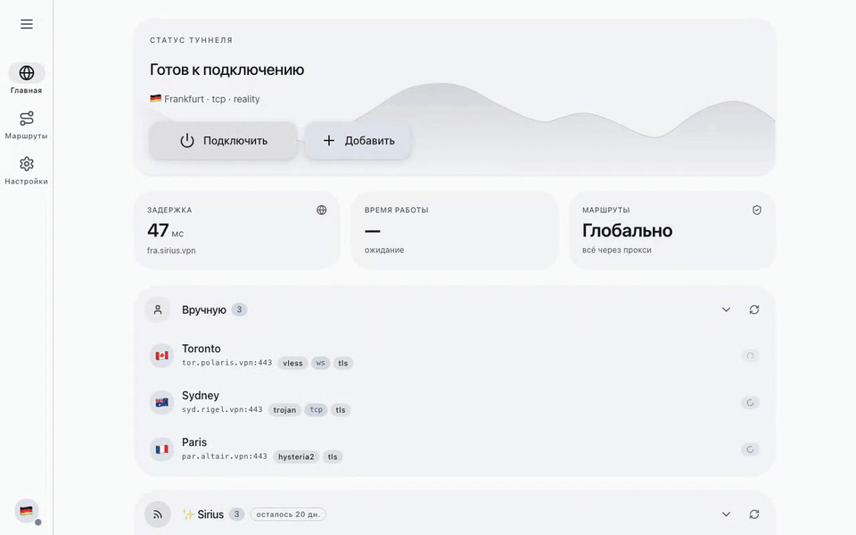

[English](./README.md) · [Русский](./README.ru.md) · [Español](./README.es.md) · [中文](./README.zh-CN.md) · [فارسی](./README.fa.md) · [العربية](./README.ar.md)

<p align="center">
  <picture>
    <source media="(prefers-color-scheme: dark)" srcset="./site/media/logo-dark.png">
    
  </picture>
</p>

<p align="center"><strong>Расширение VLESS для браузера Chrome</strong></p>
<p align="center"><em>Маршрутизация трафика браузера через ваши прокси — без системного VPN.</em></p>

<p align="center">
  <a href="https://chromewebstore.google.com/detail/noctis/nmhobajopepdpihahepaddpdifdcenpn"></a>
  <a href="./site/LICENSE.md"></a>
  <a href="https://github.com/c0nn3ct-info/noctis"></a>
  <a href="https://noctis.c0nn3ct.info"></a>
</p>

<p align="center">
  <picture>
    <source media="(prefers-color-scheme: dark)" srcset="./site/media/demo-ru-dark.gif">
    
  </picture>
</p>

> [!IMPORTANT]
> Noctis — это прокси для браузера, а не системный VPN. Маршрутизируется только трафик Chrome; остальная ОС остаётся на вашем реальном подключении. Расширение бесплатно под проприетарной EULA; локальный компонент — open source (MIT).

Noctis — бесплатное расширение, которое направляет трафик Chrome через ваши прокси-серверы VLESS, VMess, Trojan, Shadowsocks, Hysteria2, Reality и других типов. Локальный компонент управляет выбранным движком: sing-box, xray-core или mihomo. Системный VPN и отдельное окно клиента не нужны — прокси действует только в браузере.

## ✨ Возможности

- **Подключаемый движок прокси** — Noctis поставляется с sing-box и умеет управлять xray-core или mihomo, автоматически выбирая нужный движок под каждый сервер — поэтому xhttp, потоки REALITY-vision, Snell и другое просто работают.
- **Серверы из ссылок подключения, QR-кодов и подписок** — Вставьте `vless://`, `vmess://`, `trojan://`, `ss://`, `hysteria2://`, `tuic://`, `wireguard://` или отсканируйте QR-код. Подписки обновляются автоматически по расписанию.
- **Маршрутизация по правилам** — Сопоставление по домену, GeoSite или GeoIP. Каждое правило направляет в прокси, напрямую или блокирует.
- **Три режима маршрутизации** — Global — всё через прокси. Rules — только совпадения по правилам. Direct — обход прокси полностью.
- **Health checks и автоматический failover** — Фоновые замеры задержки; ручной пинг по одному клику. Неработающие серверы автоматически уходят из активного маршрута.
- **Закреплённые серверы** — Три избранных сервера всегда доступны в верхней части всплывающего окна. Переключайте активный сервер, не открывая боковую панель.
- **Живой поток логов** — stdout и stderr движка прокси стримятся прямо в расширение. Диагностика подключений без выхода из браузера.
- **Защита от утечек WebRTC** — Опциональный тумблер блокирует UDP мимо прокси, чтобы WebRTC не раскрыл ваш реальный IP.
- **Встроенные правила блокировки рекламы и трекеров** — Семейства `geosite:ads` по умолчанию маршрутизируются в block. Можно отключить, если предпочитаете решать это иначе.

## 🔌 Поддерживаемые протоколы

`VLESS` · `VLESS Reality` · `VMess` · `Trojan` · `Shadowsocks` · `Hysteria/2` · `TUIC` · `WireGuard` · `AnyTLS` · `ShadowTLS`

Noctis поддерживает VLESS (включая VLESS Reality), VMess, Trojan, Shadowsocks, Hysteria2, TUIC, WireGuard, AnyTLS и ShadowTLS. Конфигурации V2Ray, Xray и панелей 3X-UI работают без преобразования вручную: вставьте ссылку подключения или адрес подписки, и расширение подготовит конфигурацию для нужного движка. Xray поддерживает xhttp/splithttp и варианты потоков XTLS, а Mihomo — Snell, SSR и другие протоколы.

## 🧩 Как это устроено

Браузер не может сам запустить движок прокси. Три части разделяют работу через границу песочницы — и стрелка между ними единственное место, где идут сообщения.

```
  Browser                                    Ваша машина
  ┌──────────────────┐  native messaging   ┌───────────────────────┐
  │ Расширение       │ ◀─────────────────▶ │  noctis-host          │
  │ Noctis           │   события · логи    │ (локальный компонент) │
  │ popup · panel    │                     └────────┬──────────────┘
  └────────┬─────────┘                              │ запуск · конфиг
           │                                        ▼
           │                                ┌──────────────────┐
           │  Chrome proxy → SOCKS/HTTP     │  движок прокси   │
           └───────────────────────────────▶│                  │
                                            └────────┬─────────┘
                                                     │ шифрованный канал
                                                     ▼
                                            ┌──────────────────┐
                                            │ Прокси-серверы   │
                                            └──────────────────┘
```

Noctis по умолчанию поставляется с sing-box и умеет управлять xray-core и mihomo. Небольшой локальный компонент следит за движком на вашей машине, а Noctis автоматически выбирает нужный под каждый сервер — поэтому протоколы, которые не тянет один движок, просто работают. xray открывает xhttp/splithttp и варианты потоков XTLS (REALITY-vision); mihomo добавляет Snell, SSR и Mieru. Расширение в браузере отправляет только решения о маршрутизации — никогда сырой трафик.

## 🧭 Правила маршрутизации

Профиль маршрутизации - это три группы правил и порядок, в котором они проверяются. Порядок показывают чипы **Evaluation order** на экране профиля, их можно перетаскивать.

| Группа | Что происходит с совпадением |
| --- | --- |
| **Direct** | Запрос уходит через ваше обычное соединение, минуя прокси. |
| **Proxy** | Запрос уходит через активный сервер. |
| **Block** | Запрос сбрасывается. Noctis показывает свою страницу блокировки и называет сработавшее правило. |

Побеждает первое совпадение, поэтому порядок решает спорные случаи. При порядке по умолчанию `Direct → Proxy → Block` хост, указанный и в Direct, и в Block, уйдёт напрямую.

В каждой группе три вида записей: **Domains** (`example.com`, `*.example.com`), **Geosite** (название категории, например `youtube` или `ads`), **Geoip** (код страны, например `cn`, или подсеть CIDR).

Всё, что не совпало ни с одной группой, идёт напрямую. Группы работают только в режиме Rules: Global отправляет через прокси весь трафик, Direct не использует прокси вовсе.

### Когда добавлять в Block

Block сбрасывает трафик вместо того, чтобы его маршрутизировать: домены рекламы и трекеров, точки сбора телеметрии, сайт, который не должен открываться в этом браузере. Встроенные правила уже отправляют категории `geosite:ads` в Block, поэтому пустой Block - обычная ситуация. Если страница оказалась заблокирована неожиданно, на странице блокировки указаны профиль и правило, и оттуда правило можно удалить.

## 📥 Установка

Расширению Noctis нужен небольшой локальный компонент на вашей машине. Локальный компонент управляет движком прокси — sing-box, xray или mihomo — который и проксирует трафик.

### Перед установкой

- Браузер на Chromium версии 120 или новее (Chrome, Chromium, Edge, Brave, Arc, Vivaldi, Opera, Yandex Browser).
- Около 100 МБ свободного места для локального компонента и движков прокси.
- Без admin / root прав — всё устанавливается в ваш пользовательский аккаунт.

### Установите расширение

Установите Noctis из [Chrome Web Store](https://chromewebstore.google.com/detail/noctis/nmhobajopepdpihahepaddpdifdcenpn). Откройте расширение после установки — оно обнаружит отсутствие локального компонента и покажет диалог установки с уже подставленной командой для вашей машины.

### Запустите установщик локального компонента

Скопируйте команду из окна настройки локального компонента и вставьте её в терминал. Идентификатор расширения уже подставлен. Команда выглядит так:

Исходники локального компонента: <https://github.com/c0nn3ct-info/noctis>

**macOS**
```bash
curl -fsSL https://noctis.c0nn3ct.info/macos.sh | bash -s -- nmhobajopepdpihahepaddpdifdcenpn
```

**Linux**
```bash
curl -fsSL https://noctis.c0nn3ct.info/linux.sh | bash -s -- nmhobajopepdpihahepaddpdifdcenpn
```

**Windows (PowerShell)**
```powershell
$env:NOCTIS_EXT_ID='nmhobajopepdpihahepaddpdifdcenpn'; iwr -useb https://noctis.c0nn3ct.info/windows.ps1 | iex
```

Установщик скачивает noctis-host и движки прокси (sing-box, xray, mihomo) в каталог пользовательских данных и пишет манифест native-messaging для каждого поддерживаемого браузера.

При первом обращении расширения к локальному компоненту браузер может показать одноразовое подтверждение native-messaging — подтвердите его.

### Первый запуск

Откройте всплывающее окно расширения, вставьте ссылку подключения `vless://`, `ss://` или `trojan://` либо адрес подписки и выберите активный сервер. Индикатор состояния станет зелёным, когда движок начнёт принимать трафик.

### Обновление

Запустите ту же команду для вашей ОС повторно — скрипт идемпотентен и заменит существующие бинарники.

### Удаление

1. Удалите расширение через `chrome://extensions`.
2. Удалите каталог данных Noctis:
   - macOS / Linux: `~/.local/share/noctis`
   - Windows: `%LOCALAPPDATA%\Noctis`

## ❓ FAQ

**Что такое VLESS и зачем он нужен в браузере?**
VLESS — это легковесный прокси-протокол из семейства V2Ray/Xray. Сам по себе он не шифрует трафик — за шифрование отвечает TLS — поэтому быстрый и легко маскируется под обычный HTTPS. Использование VLESS через расширение браузера означает, что проксируется только трафик браузера; остальная операционная система остаётся на вашем реальном подключении.

**Чем расширение-прокси для браузера отличается от VPN?**
VPN тоннелирует все приложения системы через одно соединение и обычно требует прав администратора. Прокси-расширение для браузера вроде Noctis маршрутизирует только браузер, не требует root или admin и позволяет одновременно держать Zoom, Steam, Telegram desktop и торренты на вашем реальном подключении.

**Поддерживает ли Noctis VLESS Reality?**
Да. Noctis без изменений передаёт локальному компоненту параметры Reality (Server Name, Fingerprint, SNI, Dest, открытый ключ и short ID) и запускает сервер на совместимом движке. Xray полностью поддерживает поток XTLS Vision. Вставьте ссылку подключения `vless://...flow=xtls-rprx-vision&security=reality` — расширение импортирует все поля.

**Какие протоколы прокси поддерживает Noctis?**
VLESS, VMess, Trojan, Shadowsocks, Hysteria2, TUIC, WireGuard, AnyTLS и ShadowTLS — плюс xhttp/splithttp, Snell, SSR и другое через xray и mihomo. Share-ссылки V2Ray и Xray работают как есть.

**Безопасно ли использовать прокси-расширение для Chrome?**
Noctis ничего не отправляет разработчику: в нём нет аналитики, телеметрии и удалённой конфигурации. Конфигурации серверов хранятся в локальном хранилище браузера. Локальный компонент работает без прав администратора. Полный список разрешений и их назначение приведены в [политике конфиденциальности](./site/PRIVACY.md).

**Работает ли Noctis на Windows, macOS и Linux?**
Да — в Chromium-браузерах на Windows, macOS и Linux (Chrome, Edge, Brave, Arc, Vivaldi, Opera, Yandex Browser). Установщик локального компонента — одна команда для каждой платформы.

**Можно ли добавить адрес подписки для автоматического обновления серверов?**
Да. Добавьте адрес подписки один раз, и Noctis будет обновлять её по расписанию. Закреплённые и активный серверы сохраняются при обновлении списка.

**Поможет ли Noctis обойти блокировку Telegram, YouTube и других сервисов?**
Noctis — это всего лишь прокси-клиент, который маршрутизирует браузер через сервер, который вы предоставили. Если ваш сервер находится в регионе, где нужный сайт доступен, Noctis доведёт вас туда. Серверы Noctis не предоставляет — их добавляете вы.

**Поддерживается ли защита от утечек WebRTC?**
Да. Опциональный тумблер блокирует UDP мимо прокси, чтобы WebRTC не раскрыл ваш реальный IP, пока прокси активен.

**Сколько стоит расширение Noctis?**
Бесплатно. Расширение бесплатно в Chrome Web Store, локальный компонент — open-source под MIT. Вы платите только за прокси-серверы, которые выбираете сами.

**Что делает раздел Block в профиле маршрутизации?**
Block сбрасывает подходящие запросы, вместо того чтобы куда-то их отправлять: ни прокси, ни прямого соединения. Noctis показывает свою страницу блокировки и называет сработавшее правило. Вся цепочка описана в разделе [Правила маршрутизации](#-правила-маршрутизации).

## 🙏 Благодарности

- **[sing-box](https://github.com/SagerNet/sing-box)** (GPL-3.0), **[xray-core](https://github.com/XTLS/Xray-core)** (MPL-2.0) и **[mihomo](https://github.com/MetaCubeX/mihomo)** (GPL-3.0) — движки прокси, которые делают всю upstream-маршрутизацию и шифрование. Noctis — управляющая поверхность; работу делает движок, а Noctis автоматически выбирает нужный под каждый сервер.
- **[V2Ray](https://github.com/v2fly/v2ray-core)** и **[Xray](https://github.com/XTLS/Xray-core)** — оригинальный дизайн протоколов (VLESS, VMess, Reality), которые Noctis говорит.

## ⚖️ Юридическая информация

- Лицензия — проприетарная EULA: см. [LICENSE](./site/LICENSE.md) или <https://noctis.c0nn3ct.info/ru/license/>.
- Приватность — см. [PRIVACY](./site/PRIVACY.md) или <https://noctis.c0nn3ct.info/ru/privacy/>.
- Локальный компонент — лицензия MIT: см. <https://github.com/c0nn3ct-info/noctis>.
- Движки прокси — sing-box (GPL-3.0), xray-core (MPL-2.0) и mihomo (GPL-3.0), каждый переиздаётся под своей upstream-лицензией.
